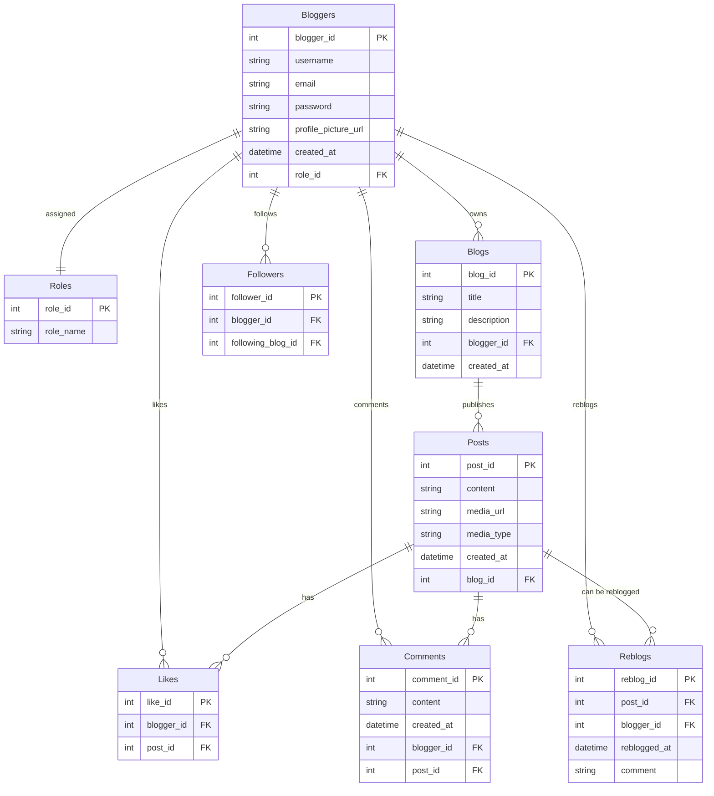
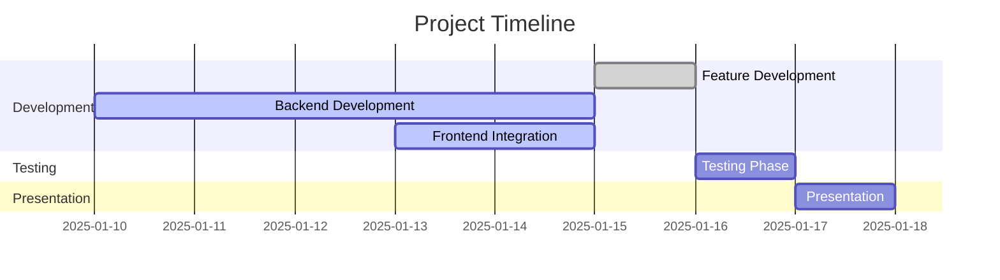

# Not Tumblr

## Summary
**Not Tumblr** is a modern full-stack microblogging and social media platform, designed to replicate the core features of Tumblr while showcasing cutting-edge development practices. Built with a Java Spring Boot backend and a React frontend enhanced with ShadCN UI components, it provides an intuitive and responsive user experience. Features include blogger authentication, customizable blogs, multimedia post creation, reblogs, likes, comments, GIF support, and a rich search interface powered by Algolia. Seamlessly integrated with TanStack Query and Router for efficient state and route management, it demonstrates scalability, usability, and real-time interactions.

This project is designed to encourage creativity, build communities, and serve as a demonstration of the technical expertise of Revature developers. It is an innovative platform and a robust foundation for future enhancements.

---

## Target Audience
Foster creativity and build communities around shared interests, with a focus on connecting developers, designers, and tech enthusiasts.

---

## Technologies Used

- **Frontend**: React, ShadCN, Tailwind CSS, TanStack Router, TanStack Query
- **Backend**: Java Spring Boot, Postgres SQL, JWT (JSON Web Tokens)
- **APIs**: Algolia for search, DummyJSON for mock data, Giphy for GIFs, and AWS S3 for image uploads

---

## ERD

---

## Timeline

---

## User Stories

- **Authentication**
  - As a blogger, I can register with a username, email, and password.
  - As a blogger, I can log in and log out securely using JWT.
- **Blog Management**
  - As a blogger, I can create and customize a blog with a title, description, and theme.
  - As a blogger, I can manage multiple blogs under one account.
- **Post Interactions**
  - As a blogger, I can create posts with text, images, GIFs, or videos.
  - As a blogger, I can like and comment on posts.
  - As a blogger, I can reblog posts with an optional comment.
  - As a blogger, I can delete my posts.
  - As a blogger, I can create text-only posts without attaching media.
- **Discovery**
  - As a blogger, I can search for posts, blogs, and hashtags using Algolia.
  - As a blogger, I can see trending topics in real time via the Twitter API.
- **Followers and Community**
  - As a blogger, I can follow other blogs and see their posts in my feed.
  - As a blogger, I can view my followers and the blogs I follow.

---

## External APIs

- **DummyJSON**: Provides mock data for posts, blogs, and bloggers during development.
- **Algolia API**: Enables efficient and responsive search functionality for posts, blogs, and hashtags.
- **Twitter API**: Displays trending topics and hashtags in real-time, enriching the discovery experience.
- **Giphy API**: Allows bloggers to search, share, and embed GIFs into posts and comments.
- **AWS S3**: Handles image uploads for profile pictures and other media, providing secure and scalable storage.

---

This document provides a comprehensive overview of the Not Tumblr project, aligning its features and goals with modern web development practices and a Tumblr-like experience.
